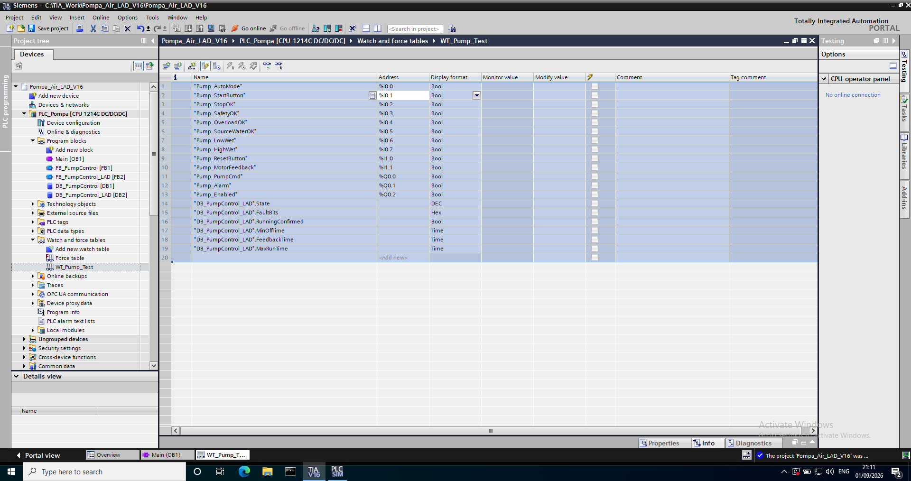

# Watch Table `WT_Pump_Test`

Watch table ini sudah tersimpan di dalam `Pompa_Air_LAD_V16.zap16`. Setelah proyek di-*retrieve* dan di-download ke PLCSIM, buka **Watch and force tables → WT_Pump_Test** lalu aktifkan monitoring.

## Entri

| No. | Tag | Tipe/kegunaan |
|---:|---|---|
| 1 | `Pump_AutoMode` | Input AUTO/MANUAL |
| 2 | `Pump_StartButton` | Input START |
| 3 | `Pump_StopOK` | Input rangkaian STOP sehat |
| 4 | `Pump_SafetyOK` | Input izin keselamatan |
| 5 | `Pump_OverloadOK` | Input overload sehat |
| 6 | `Pump_SourceWaterOK` | Input sumber air tersedia |
| 7 | `Pump_LowWet` | Input sensor level rendah |
| 8 | `Pump_HighWet` | Input sensor level tinggi |
| 9 | `Pump_ResetButton` | Input RESET |
| 10 | `Pump_MotorFeedback` | Input feedback kontaktor/motor |
| 11 | `Pump_PumpCmd` | Output command pompa |
| 12 | `Pump_Alarm` | Output alarm |
| 13 | `Pump_Enabled` | Output kontrol siap |
| 14 | `DB_PumpControl_LAD.State` | Status urutan, format DEC |
| 15 | `DB_PumpControl_LAD.FaultBits` | Mask fault, format Hex |
| 16 | `DB_PumpControl_LAD.RunningConfirmed` | Status feedback terkonfirmasi |
| 17 | `DB_PumpControl_LAD.MinOffTime` | Preset minimum OFF |
| 18 | `DB_PumpControl_LAD.FeedbackTime` | Preset timeout feedback |
| 19 | `DB_PumpControl_LAD.MaxRunTime` | Preset runtime maksimum |

Untuk pengujian normal, modifikasi input pada kolom **Modify value**. Jangan memaksa output `Pump_PumpCmd`, `Pump_Alarm`, atau `Pump_Enabled`, karena hal tersebut melewati hasil logika program.

